# x3dom 3D House

This project was developed during the Virtual Reality course at university and involved the use of the x3dom library and custom implementation using HTML.

## Description

The x3dom 3D House project showcases the capabilities of the x3dom library for creating interactive 3D experiences. The project includes a custom implementation using HTML to create a virtual house with various rooms and objects.

## Features

- Interactive 3D visualization of a house
- Multiple rooms with different furniture and objects
- Navigation controls for exploring the virtual environment

## Installation

To run the x3dom 3D House project locally, follow these steps:

1. Clone the repository: 
    ```bash
        git clone https://github.com/your-username/x3dom-3d-house.git
    ```
3. Open project directory and `index.html` in your browser.

## Usage

Once you have the x3dom 3D House project running, you can:

- Explore the virtual house by clicking and dragging to rotate the view
- Use the provided navigation controls to move around the rooms
- Interact with objects in the scene by clicking on them

## Screenshots

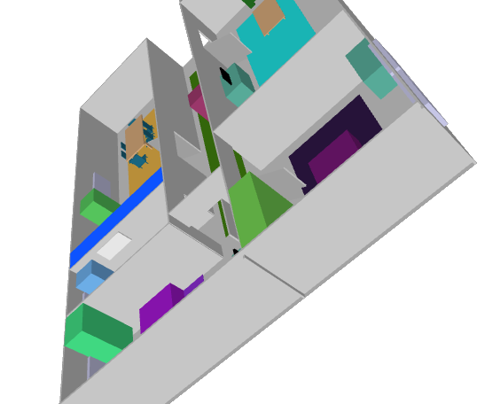
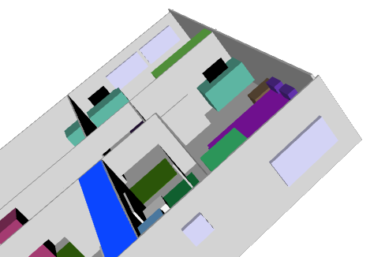
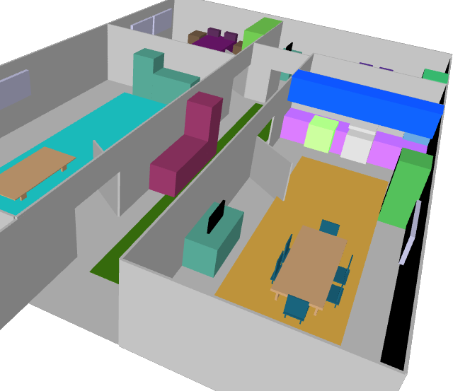
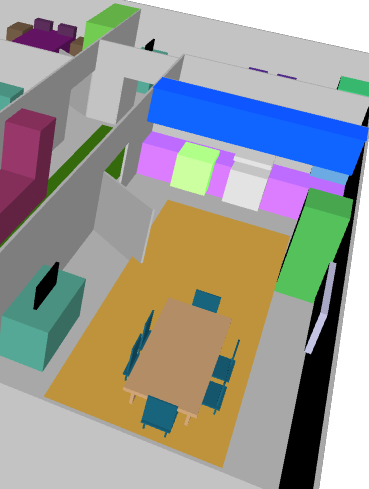
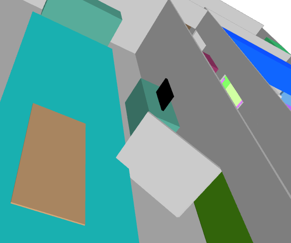
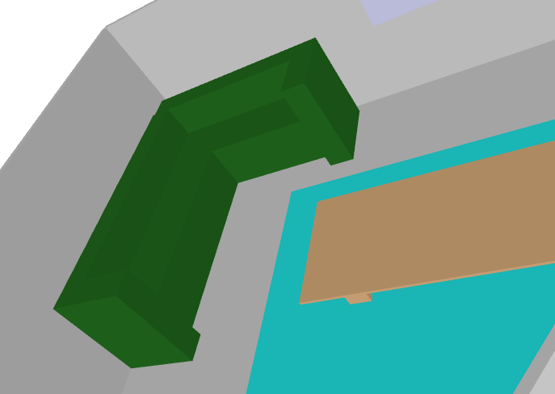
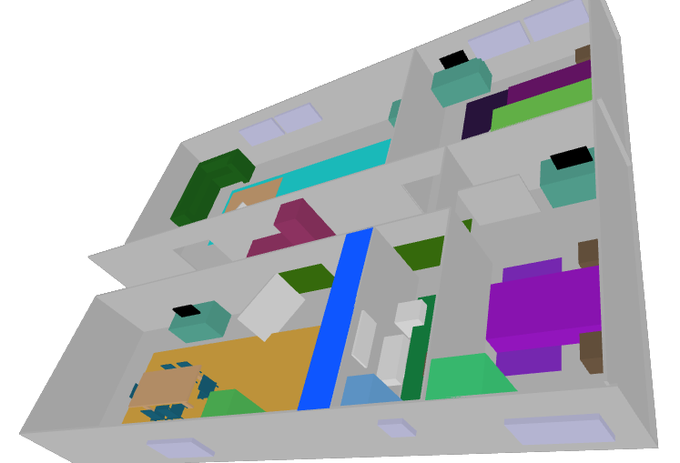
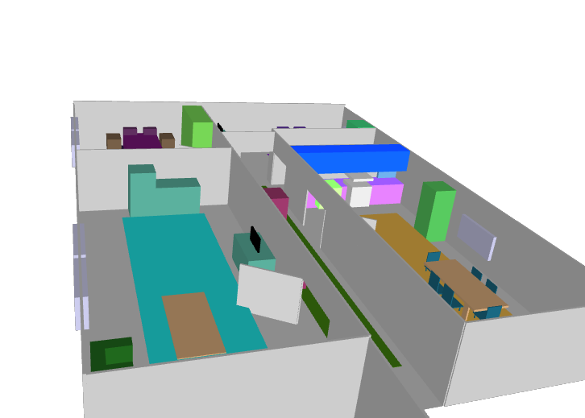
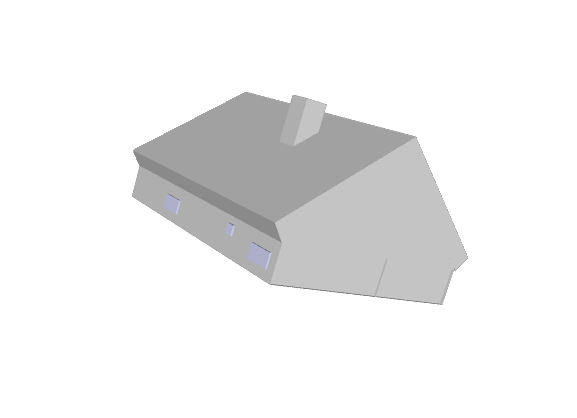
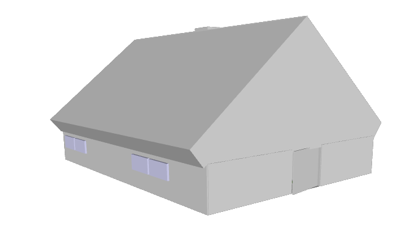
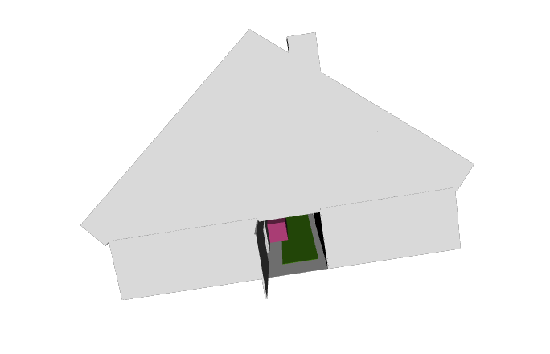

## Credits

This project utilizes the x3dom library, which can be found at [x3dom.org](https://x3dom.org).

## License

The x3Dom 3D House project is licensed under the [MIT License](LICENSE).